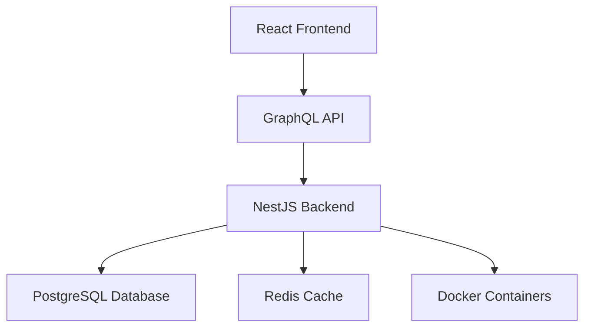
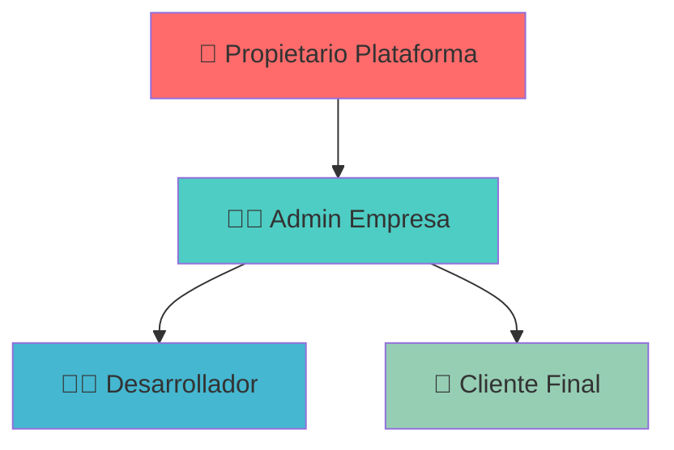
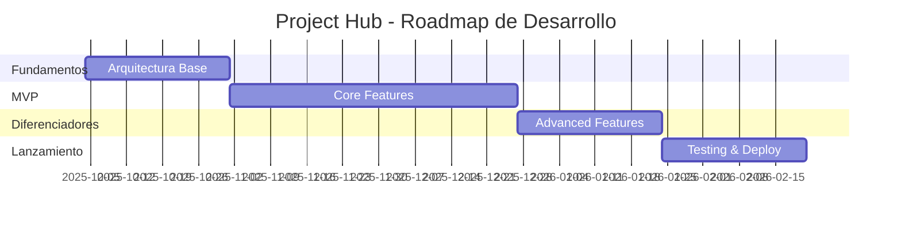

# 🚀 Project Hub

> **Plataforma SaaS Multi-Tenant para Casas de Desarrollo de Software**

Una solución integral que centraliza proyectos, documentación, equipos y comunicación, diseñada para resolver los problemas de gestión del conocimiento, falta de transparencia con el cliente y control de tiempos.

---

## 📋 Tabla de Contenidos

- [🎯 Resumen Ejecutivo](#-resumen-ejecutivo)
- [💼 Modelo de Negocio](#-modelo-de-negocio)
- [🏗️ Arquitectura Tecnológica](#️-arquitectura-tecnológica)
- [👥 Roles y Permisos](#-roles-y-permisos)
- [✅ Roadmap de Desarrollo](#-roadmap-de-desarrollo)
- [🎯 Fases del Proyecto](#-fases-del-proyecto)

---

## 🎯 Resumen Ejecutivo

**Project Hub** es una plataforma SaaS Multi-Tenant que centraliza todas las operaciones de casas de desarrollo de software, proporcionando transparencia total, gestión eficiente de equipos y planificación estratégica integrada.

## 💼 Modelo de Negocio

### 🎯 Propuesta de Valor

| 💡 **Aspecto** | 📝 **Definición** | ⭐ **Valor Diferencial** |
|---|---|---|
| **🔄 Modelo de Venta** | B2B por suscripción recurrente | **Licencia por Empresa** con usuarios ilimitados |
| **🎯 Cliente Objetivo** | Casas de desarrollo y agencias digitales | Escalabilidad sin costo adicional por usuario |
| **🚀 Propuesta Única** | Transparencia total + planificación integrada | **Motor de Estimaciones** para crecimiento planificado |

### 💰 Ventajas Competitivas

- ✅ **Usuarios ilimitados** por licencia empresarial
- ✅ **Transparencia total** con el cliente final
- ✅ **Gestión del conocimiento** centralizada
- ✅ **Simulador de costos** para nuevas funcionalidades

---

## 🏗️ Arquitectura Tecnológica

### 🛠️ Stack Tecnológico

| 🔧 **Componente** | 💻 **Tecnología** | 📋 **Función** |
|---|---|---|
| **🎨 Frontend** | **React + TypeScript** | Interfaz de usuario moderna y reactiva |
| **🔗 API** | **GraphQL + Apollo** | Comunicación eficiente cliente-servidor |
| **⚙️ Backend** | **NestJS + TypeScript** | Lógica de negocio robusta y escalable |
| **🗃️ Base de Datos** | **PostgreSQL** | Gestión de datos multi-tenant |
| **🚀 Cache** | **Redis** | Optimización de rendimiento |
| **📦 Contenedores** | **Docker** | Despliegue y desarrollo consistente |

### 🏢 Arquitectura Multi-Tenant

- **🔒 Aislamiento completo** por `tenant_id`
- **🔐 Seguridad a nivel de fila** (Row Level Security)
- **📊 Datos compartimentados** por empresa

---

## 👥 Roles y Permisos

### 🔐 Jerarquía de Acceso

| 👤 **Rol** | 🌍 **Alcance** | 🛠️ **Funciones Principales** |
|---|---|---|
| **🏢 Super Admin** | **Global** | • Gestión de licencias • Facturación • Mantenimiento del sistema |
| **👨‍💼 Admin Empresa** | **Su empresa** | • Crear proyectos • Gestionar equipo • Asignar permisos |
| **👩‍💻 Desarrollador** | **Sus tareas** | • Gestionar tareas asignadas • Registro de tiempos • Consultar documentación |
| **📱 Cliente Final** | **Su proyecto** | • Ver progreso • Reportar bugs • Proponer funcionalidades |

---

## ✅ Roadmap de Desarrollo

### 🚀 Módulos Esenciales (MVP)

| 📦 **Módulo** | 🔧 **Funcionalidades Clave** |
|---|---|
| **🔐 Gestión de Cuentas** | • Registro empresarial • Login multi-tenant • Aislamiento de datos |
| **📋 Proyectos & Tareas** | • CRUD completo • Tablero Kanban • Asignación de responsables |
| **👥 Gestión de Equipos** | • Invitación de usuarios • Asignación de roles • Permisos granulares |
| **⏱️ Registro de Tiempos** | • Timer start/stop • Tracking por tarea • Reportes básicos |
| **👤 Portal del Cliente** | • Vista de progreso • Dashboard personalizado • Notificaciones |

### ⭐ Módulos Diferenciadores (Post-MVP)

| 📦 **Módulo** | 🔧 **Funcionalidades Avanzadas** |
|---|---|
| **📚 Documentación** | • Editor enriquecido • Snippets de código • Versionado automático |
| **🐛 Bug Tracking** | • Reporte estructurado • Clasificación por gravedad • Flujo de resolución |
| **📊 Reportes Avanzados** | • Gráficas interactivas • Métricas de productividad • Exportación múltiple |
| **💰 Estimaciones** | • Motor de cálculo flexible • Simulador de costos • Planificación estratégica |

---

## 🎯 Fases del Proyecto

### 📅 Cronograma de Desarrollo

| 🚧 **Fase** | ⏱️ **Duración** | 🎯 **Enfoque Principal** | 🎁 **Entregable Clave** |
|---|---|---|---|
| **🏗️ Fundamentos** | **4 semanas** | • Arquitectura base • Auth multi-tenant • Setup DevOps | ✅ Login empresarial funcional |
| **🚀 MVP** | **8 semanas** | • Módulos core • Interfaces principales • Flujos básicos | ✅ Plataforma operativa completa |
| **⭐ Diferenciadores** | **4 semanas** | • Features únicas • Reportes avanzados • Motor de estimaciones | ✅ Producto con ventaja competitiva |
| **🎊 Lanzamiento** | **4 semanas** | • Testing integral • Optimización • Sistema de facturación | ✅ Producto listo para el mercado |

### 📈 Resumen Ejecutivo

- **⏱️ Tiempo Total**: 20 semanas (5 meses)
- **💰 Modelo**: SaaS B2B con licencias empresariales
- **🎯 Target**: Casas de desarrollo y agencias digitales
- **🚀 MVP**: Funcional en 12 semanas
- **🌟 Diferenciación**: Transparencia total + estimaciones inteligentes

---

## 🤝 Contribución

Este proyecto está en desarrollo activo. Para contribuir o reportar issues, por favor contacta al equipo de desarrollo.

## 📄 Licencia

Todos los derechos reservados - Project Hub 2025