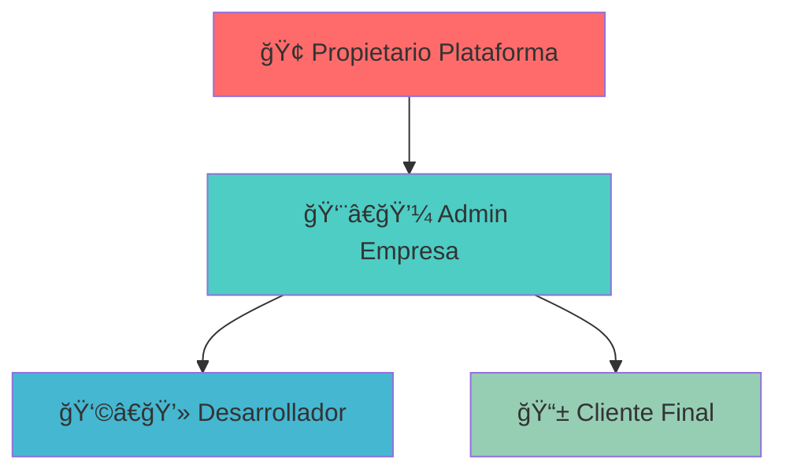

# 🚀 Project Hub

> **Plataforma SaaS Multi-Tenant para Casas de Desarrollo de Software**

Una solución integral que centraliza proyectos, documentación, equipos y comunicación, diseñada para resolver los problemas de gestión del conocimiento, falta de transparencia con el cliente y control de tiempos.

---

## 📋 Tabla de Contenidos

- [🎯 Resumen Ejecutivo](#-resumen-ejecutivo)
- [💼 Modelo de Negocio](#-modelo-de-negocio)
- [🏗️ Arquitectura Tecnológica](#️-arquitectura-tecnológica)
- [👥 Roles y Permisos](#-roles-y-permisos)
- [✅ Roadmap de Desarrollo](#-roadmap-de-desarrollo)
- [🎯 Fases del Proyecto](#-fases-del-proyecto)

---

## 🎯 Resumen Ejecutivo

**Project Hub** es una plataforma SaaS Multi-Tenant que centraliza todas las operaciones de casas de desarrollo de software, proporcionando transparencia total, gestión eficiente de equipos y planificación estratégica integrada.

## 💼 Modelo de Negocio

### 🎯 Propuesta de Valor

| 💡 **Aspecto** | 📝 **Definición** | ⭐ **Valor Diferencial** |
|---|---|---|
| **🔄 Modelo de Venta** | B2B por suscripción recurrente | **Licencia por Empresa** con usuarios ilimitados |
| **🎯 Cliente Objetivo** | Casas de desarrollo y agencias digitales | Escalabilidad sin costo adicional por usuario |
| **🚀 Propuesta Única** | Transparencia total + planificación integrada | **Motor de Estimaciones** para crecimiento planificado |

### 💰 Ventajas Competitivas

- ✅ **Usuarios ilimitados** por licencia empresarial
- ✅ **Transparencia total** con el cliente final
- ✅ **Gestión del conocimiento** centralizada
- ✅ **Simulador de costos** para nuevas funcionalidades

---

## 🏗️ Arquitectura Tecnológica

### 🛠️ Stack Tecnológico


| 🔧 **Componente** | 💻 **Tecnología** | 📋 **Función** |
|---|---|---|
| **🎨 Frontend** | **React + TypeScript** | Interfaz de usuario moderna y reactiva |
| **🔗 API** | **GraphQL + Apollo** | Comunicación eficiente cliente-servidor |
| **⚙️ Backend** | **NestJS + TypeScript** | Lógica de negocio robusta y escalable |
| **🗃️ Base de Datos** | **PostgreSQL** | Gestión de datos multi-tenant |
| **🚀 Cache** | **Redis** | Optimización de rendimiento |
| **📦 Contenedores** | **Docker** | Despliegue y desarrollo consistente |

### 🏢 Arquitectura Multi-Tenant

- **🔒 Aislamiento completo** por `tenant_id`
- **🔐 Seguridad a nivel de fila** (Row Level Security)
- **📊 Datos compartimentados** por empresa

---

## 👥 Roles y Permisos

### 🔐 Jerarquía de Acceso



| 👤 **Rol** | 🌍 **Alcance** | 🛠️ **Funciones Principales** |
|---|---|---|
| **🏢 Super Admin** | **Global** | • Gestión de licencias<br>• Facturación<br>• Mantenimiento del sistema |
| **👨‍💼 Admin Empresa** | **Su empresa** | • Crear proyectos<br>• Gestionar equipo<br>• Asignar permisos |
| **👩‍💻 Desarrollador** | **Sus tareas** | • Gestionar tareas asignadas<br>• Registro de tiempos<br>• Consultar documentación |
| **📱 Cliente Final** | **Su proyecto** | • Ver progreso<br>• Reportar bugs<br>• Proponer funcionalidades |

---

## ✅ Roadmap de Desarrollo

### 🚀 Módulos Esenciales (MVP)

| 📦 **Módulo** | 🔧 **Funcionalidades Clave** |
|---|---|
| **🔐 Gestión de Cuentas** | • Registro empresarial<br>• Login multi-tenant<br>• Aislamiento de datos |
| **📋 Proyectos & Tareas** | • CRUD completo<br>• Tablero Kanban<br>• Asignación de responsables |
| **👥 Gestión de Equipos** | • Invitación de usuarios<br>• Asignación de roles<br>• Permisos granulares |
| **⏱️ Registro de Tiempos** | • Timer start/stop<br>• Tracking por tarea<br>• Reportes básicos |
| **👤 Portal del Cliente** | • Vista de progreso<br>• Dashboard personalizado<br>• Notificaciones |

### ⭐ Módulos Diferenciadores (Post-MVP)

| 📦 **Módulo** | 🔧 **Funcionalidades Avanzadas** |
|---|---|
| **📚 Documentación** | • Editor enriquecido<br>• Snippets de código<br>• Versionado automático |
| **🐛 Bug Tracking** | • Reporte estructurado<br>• Clasificación por gravedad<br>• Flujo de resolución |
| **📊 Reportes Avanzados** | • Gráficas interactivas<br>• Métricas de productividad<br>• Exportación múltiple |
| **💰 Estimaciones** | • Motor de cálculo flexible<br>• Simulador de costos<br>• Planificación estratégica |

---

## 🎯 Fases del Proyecto

### 📅 Cronograma de Desarrollo


| 🚧 **Fase** | ⏱️ **Duración** | 🎯 **Enfoque Principal** | 🎁 **Entregable Clave** |
|---|---|---|---|
| **🏗️ Fundamentos** | **4 semanas** | • Arquitectura base<br>• Auth multi-tenant<br>• Setup DevOps | ✅ Login empresarial funcional |
| **🚀 MVP** | **8 semanas** | • Módulos core<br>• Interfaces principales<br>• Flujos básicos | ✅ Plataforma operativa completa |
| **⭐ Diferenciadores** | **4 semanas** | • Features únicas<br>• Reportes avanzados<br>• Motor de estimaciones | ✅ Producto con ventaja competitiva |
| **🎊 Lanzamiento** | **4 semanas** | • Testing integral<br>• Optimización<br>• Sistema de facturación | ✅ Producto listo para el mercado |

### 📈 Resumen Ejecutivo

- **⏱️ Tiempo Total**: 20 semanas (5 meses)
- **💰 Modelo**: SaaS B2B con licencias empresariales
- **🎯 Target**: Casas de desarrollo y agencias digitales
- **🚀 MVP**: Funcional en 12 semanas
- **🌟 Diferenciación**: Transparencia total + estimaciones inteligentes

---

## 🚀 Instalación y Configuración

### **📋 Prerrequisitos**

Antes de comenzar, asegúrate de tener instalado:

- **Node.js 18+** - [Descargar aquí](https://nodejs.org/)
- **npm** o **yarn** - Viene con Node.js
- **Git** - [Descargar aquí](https://git-scm.com/)
- **PostgreSQL 14+** *(Opcional - se usa mock data por defecto)*

### **⚡ Instalación Rápida**

1. **Clonar el repositorio:**
   ```bash
   git clone https://github.com/Gatroxm/ProjectHub.git
   cd ProjectHub
   ```

2. **Instalar dependencias del Backend:**
   ```bash
   cd backend
   npm install
   cd ..
   ```

3. **Instalar dependencias del Frontend:**
   ```bash
   cd frontend
   npm install
   cd ..
   ```

4. **Ejecutar ambos servidores:**
   ```bash
   # En Windows (PowerShell)
   .\iniciar_servidores.ps1
   
   # En Linux/Mac
   chmod +x iniciar_servidores.sh && ./iniciar_servidores.sh
   ```

### **🖥️ URLs de Acceso**

Una vez ejecutado el script, tendrás acceso a:

- **🎨 Frontend (Aplicación):** http://localhost:5173
- **🔧 Backend API:** http://localhost:3000/api/v1
- **📚 Documentación Swagger:** http://localhost:3000/docs
- **🔍 GraphQL Playground:** http://localhost:3000/graphql

### **👤 Usuarios de Prueba**

El sistema incluye usuarios de prueba listos para usar:

```
🔐 Administrador:
   Email: admin@example.com
   Contraseña: password

👨‍💻 Desarrollador:
   Email: developer@company.com
   Contraseña: dev123

👤 Usuario básico:
   Email: test@proyectohub.com
   Contraseña: 123456

🤝 Cliente:
   Email: client@proyecto.com
   Contraseña: client2024
```

### **🛠️ Ejecución Manual (Alternativa)**

Si prefieres ejecutar cada servidor por separado:

**Backend:**
```bash
cd backend
npm run start:dev
# Se ejecuta en http://localhost:3000
```

**Frontend:**
```bash
cd frontend
npm run dev
# Se ejecuta en http://localhost:5173
```

### **⚙️ Configuración de Base de Datos (Opcional)**

Por defecto, el sistema usa datos mock. Para conectar PostgreSQL:

1. **Crear base de datos:**
   ```sql
   CREATE DATABASE project_hub_dev;
   ```

2. **Configurar variables de entorno:**
   ```bash
   # backend/.env
   DATABASE_HOST=localhost
   DATABASE_PORT=5432
   DATABASE_USERNAME=postgres
   DATABASE_PASSWORD=tu_password
   DATABASE_NAME=project_hub_dev
   ```

### **🔧 Scripts Disponibles**

```bash
# Backend
npm run start:dev      # Modo desarrollo con hot reload
npm run build          # Compilar para producción
npm run test           # Ejecutar pruebas

# Frontend
npm run dev            # Servidor de desarrollo
npm run build          # Compilar para producción
npm run preview        # Vista previa de build
```

### **🐛 Solución de Problemas**

**¿Los servidores no inician?**
```bash
# Verificar puertos ocupados
netstat -ano | findstr :3000
netstat -ano | findstr :5173

# Limpiar caché de npm
npm cache clean --force
```

**¿Problemas de CORS?**
- Verifica que el frontend esté en puerto 5173
- El backend está configurado para permitir localhost:5173

**¿Error de módulos no encontrados?**
```bash
# Reinstalar dependencias
rm -rf node_modules package-lock.json
npm install
```

---

## 🤝 Contribución

Este proyecto está en desarrollo activo. Para contribuir o reportar issues, por favor contacta al equipo de desarrollo.

## 📄 Licencia

Todos los derechos reservados - Project Hub 2025